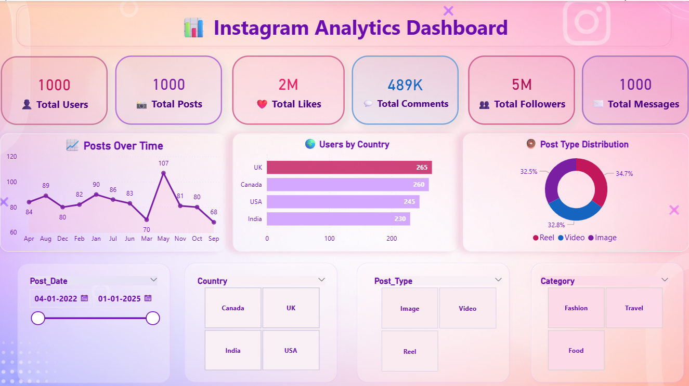
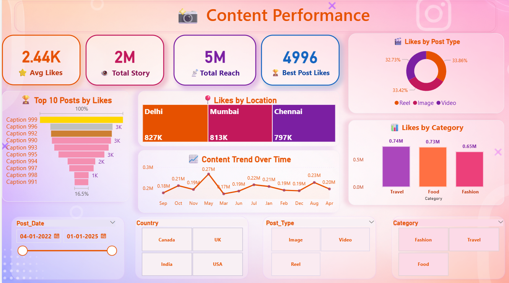
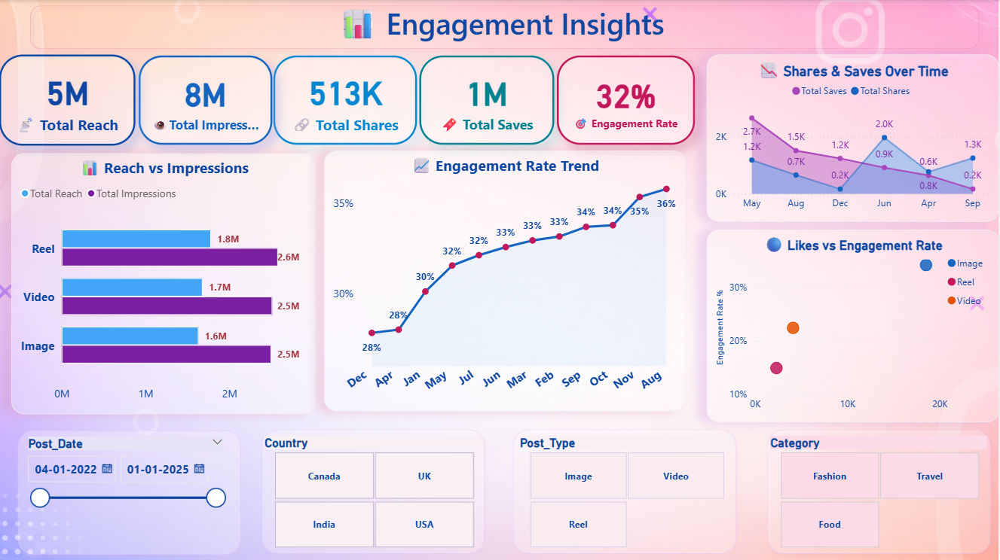
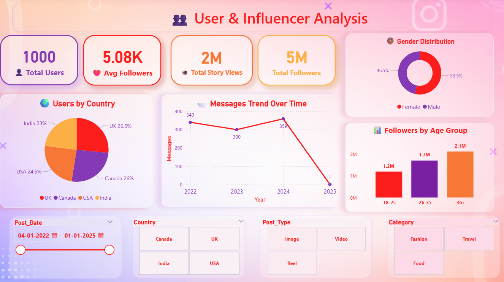
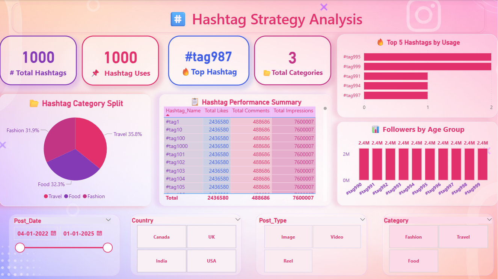

# Instagram Analytics Dashboard

## Project Overview
This Power BI dashboard analyzes Instagram performance data including:

- User Engagement
- Content Performance
- Hashtag Strategy
- Influencer Analysis
- Reach & Impressions

## Tools Used
- Power BI
- Excel
- DAX
- Data Visualization

## Dashboard Features
- Engagement Insights
- Post Performance Analysis
- Hashtag Tracking
- User Demographics
- Country-wise Analytics

## Screenshots

## Author
Archana
